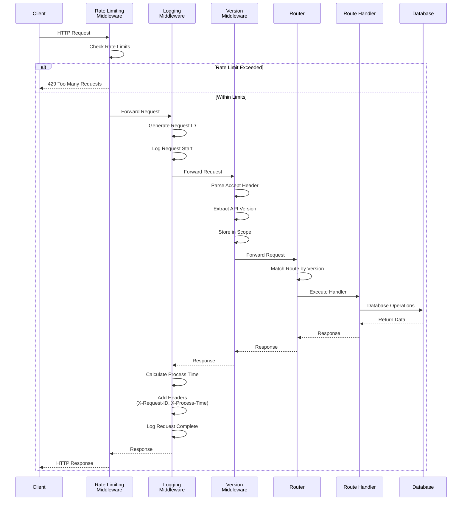
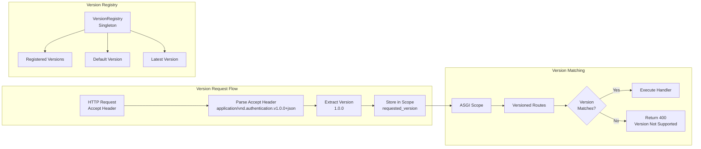

# Authentication Service

A modern, production-ready FastAPI application template for building authentication and user management services. This
project provides a robust foundation with API versioning, middleware support, database management, and a clean
architecture pattern.

## Features

- **FastAPI** - High-performance async web framework
- **API Versioning** - Semantic versioning support via Accept headers
- **Middleware Stack** - Logging, rate limiting, and version management
- **Database Management** - Async SQLModel/SQLAlchemy with connection pooling
- **Auto-Discovery Routing** - Automatic route discovery from file structure
- **Class-Based Routing** - Enhanced router with dependency injection
- **Type Safety** - Full type hints and validation
- **Database Migrations** - Alembic integration
- **Testing** - Pytest setup with async support

## Project Structure

```
authentication/
├── alembic.ini              # Alembic configuration
├── main.py                  # Application entry point
├── pyproject.toml           # Poetry dependencies and project config
├── poetry.lock              # Locked dependencies
├── Dockerfile               # Container configuration
├── migrations/              # Database migration scripts
│   ├── env.py
│   └── versions/
├── scripts/                 # Utility scripts
│   ├── dev.sh              # Development server script
│   └── start.sh            # Production start script
├── tests/                   # Test suite
│   └── unit/               # Unit tests
└── authentication/          # Main application package
    ├── __init__.py
    ├── __main__.py
    ├── app.py              # FastAPI application factory
    ├── api/                # API route definitions
    │   └── health.py
    ├── controllers/        # Request handlers/business logic
    │   └── health.py
    ├── core/               # Core application components
    │   ├── base/           # Base classes
    │   │   ├── app.py
    │   │   ├── controller.py
    │   │   └── model.py
    │   ├── config.py       # Application settings
    │   ├── constants.py    # Application constants
    │   ├── database/       # Database management
    │   │   ├── manager.py
    │   │   ├── repository.py
    │   │   └── filters.py
    │   ├── exceptions.py   # Custom exceptions
    │   ├── logging.py      # Logging configuration
    │   ├── middlewares/    # ASGI middleware
    │   │   ├── logging.py
    │   │   ├── rate_limit.py
    │   │   └── version.py
    │   ├── response.py     # Response utilities
    │   ├── routing/        # Enhanced routing system
    │   │   ├── decorators.py
    │   │   ├── dto.py
    │   │   ├── routers/
    │   │   │   ├── app.py
    │   │   │   ├── file.py
    │   │   │   └── version.py
    │   │   └── utils/
    │   │       ├── extractor.py
    │   │       └── version.py
    │   └── utils/          # Utility functions
    │       └── generators.py
    ├── models/             # SQLModel database models
    │   ├── user.py
    │   ├── account.py
    │   ├── role.py
    │   ├── permission.py
    │   ├── session.py
    │   ├── user_role.py
    │   └── role_permission.py
    ├── repositories/       # Data access layer
    └── services/           # Business logic services
```

## Setup

### Prerequisites

- Python 3.12+
- Poetry (for dependency management)
- PostgreSQL (or compatible database)
- Docker (optional, for containerized deployment)

### Installation

1. **Clone the repository**
   ```bash
   git clone <repository-url>
   cd authentication
   ```

2. **Install dependencies and pre-commit hooks**
   ```bash
   poetry install
   poetry run pre-commit install
   poetry run pre-commit install --hook-type pre-push
   ```
   
   Or install all hook types at once:
   ```bash
   poetry run pre-commit install --hook-type pre-commit --hook-type pre-merge-commit --hook-type pre-push --hook-type prepare-commit-msg --hook-type commit-msg --hook-type post-commit --hook-type post-merge --hook-type post-checkout --hook-type post-rewrite
   ```

3. **Set up environment variables**
   Create a `.env` file in the project root:
   ```bash
    cp .env.example .env
   ```
   - Update the `.env` file with your configuration (e.g., database URL, JWT secret).

4. **Run database migrations**
   ```bash
   poetry run alembic upgrade head
   ```

5. **Start the development server**
   ```bash
   poetry run python main.py
   # Or use the dev script
   ./scripts/dev.sh
   ```

   The API will be available at `http://127.0.0.1:8000`
    - API Documentation: `http://127.0.0.1:8000/docs`
    - ReDoc: `http://127.0.0.1:8000/redoc`

### Docker Setup

```bash
# Build the image
docker build -t authentication-service .

# Run the container
docker run -p 8000:8000 --env-file .env authentication-service
```

## Application Architecture

```mermaid
graph TB
    subgraph "Client Layer"
        Client[HTTP Client]
    end

    subgraph "FastAPI Application"
        App[FastAPI App Instance]
        
        subgraph "Middleware Stack"
            RateLimit[Rate Limiting Middleware]
            Logging[Logging Middleware]
            Version[Version Middleware]
            Exception[Exception Handlers]
        end
        
        subgraph "Routing Layer"
            FileRouter[FileRouter<br/>Auto-Discovery]
            AppRouter[AppRouter<br/>Class-Based]
            VersionedRouter[VersionedRouter<br/>Version Support]
        end
        
        subgraph "API Layer"
            API[API Routes]
        end
        
        subgraph "Controller Layer"
            Controllers[Controllers<br/>Business Logic]
        end
        
        subgraph "Service Layer"
            Services[Services<br/>Domain Logic]
        end
        
        subgraph "Repository Layer"
            Repositories[Repositories<br/>Data Access]
        end
        
        subgraph "Database Layer"
            DBManager[Database Manager<br/>Connection Pool]
            Models[SQLModel Models]
            DB[(PostgreSQL Database)]
        end
    end

    Client --> App
    App --> RateLimit
    RateLimit --> Logging
    Logging --> Version
    Version --> Exception
    Exception --> FileRouter
    FileRouter --> AppRouter
    AppRouter --> VersionedRouter
    VersionedRouter --> API
    API --> Controllers
    Controllers --> Services
    Services --> Repositories
    Repositories --> DBManager
    DBManager --> Models
    Models --> DB
```



## Middleware Architecture

The application uses a layered middleware stack that processes requests in a specific order:



### Middleware Details

1. **Rate Limiting Middleware** (Outermost)
    - Enforces rate limits per IP address
    - Default: 200 requests/day, 50 requests/hour
    - Uses `slowapi` with Redis support
    - Returns `429 Too Many Requests` when exceeded

2. **Logging Middleware**
    - Generates unique request IDs
    - Logs all HTTP requests with timing information
    - Adds `X-Request-ID` and `X-Process-Time` headers
    - Disables uvicorn access logs to avoid duplication

3. **Version Middleware** (Innermost)
    - Parses `Accept` header for API version
    - Supports vendor-specific media types: `application/vnd.{vendor_prefix}.{version}+json`
    - Stores requested version in ASGI scope
    - Example: `Accept: application/vnd.authentication.v1.0.0+json`

4. **Exception Handlers**
    - Global exception handling
    - Custom error responses
    - Version-specific error handling

## API Versioning System

The application implements semantic versioning (SemVer) for API endpoints using Accept header negotiation:



### Versioning Features

- **Semantic Versioning**: Full SemVer support (major.minor.patch-prerelease+build)
- **Accept Header Negotiation**: Version specified via `Accept: application/vnd.{vendor_prefix}.{version}+json`
- **Route-Level Versioning**: Each route can specify its supported version
- **Version Registry**: Centralized version management with deprecation support
- **Automatic Matching**: Routes automatically match based on requested version

### Usage Example

```python
from authentication.core.routing import AppRouter, get


class HealthRouter(AppRouter):
    @get("", version="1.0.0")
    async def get_health_v1(self):
        return {"status": "healthy", "api_version": "1.0.0"}

    @get("", version="2.0.0")
    async def get_health_v2(self):
        return {"status": "healthy", "api_version": "2.0.0", "features": ["enhanced"]}
```

**Client Request:**

```bash
curl -H "Accept: application/vnd.authentication.v2.0.0+json" \
     http://localhost:8000/health
```

## Development

### Running Tests

```bash
# Run all tests
poetry run pytest

# Run with coverage
poetry run pytest --cov=authentication

# Run specific test file
poetry run pytest tests/unit/api/test_health_api.py
```

### Code Quality

```bash
# Format code
poetry run ruff format .

# Lint code
poetry run ruff check .

# Security check
poetry run bandit -r authentication/
```

### Pre-commit Hooks

This project uses pre-commit hooks to ensure code quality before commits and pushes:

- **Pre-commit hooks** (run on every commit):
  - Trailing whitespace removal
  - End-of-file fixer
  - YAML/JSON/TOML validation
  - Large file detection
  - Merge conflict detection
  - Debug statement detection
  - Line ending normalization
  - Ruff formatting and linting
  - Bandit security checks

- **Pre-push hooks** (run before pushing to remote):
  - Pytest test suite with coverage (requires 80% coverage minimum)

To manually run all hooks:
```bash
poetry run pre-commit run --all-files
```

To run only pre-push hooks:
```bash
poetry run pre-commit run --hook-stage push --all-files
```

### Database Migrations

```bash
# Create a new migration
poetry run alembic revision --autogenerate -m "description"

# Apply migrations
poetry run alembic upgrade head

# Rollback migration
poetry run alembic downgrade -1
```

## Configuration

The application uses Pydantic Settings for configuration management. Key settings:

- `ENVIRONMENT`: `development`, `production`, or `testing`
- `DEBUG`: Enable/disable debug mode
- `DATABASE_URL`: PostgreSQL connection string
- `JWT_SECRET`: Secret key for JWT tokens
- `ENABLE_API_DOCS`: Enable/disable API documentation endpoints
- `DATABASE_POOL_SIZE`: Connection pool size (default: 10)
- `DATABASE_MAX_OVERFLOW`: Max overflow connections (default: 20)

See `authentication/core/config.py` for all available settings.

## License

[Add your license here]

## Contributing

[Add contribution guidelines here]
